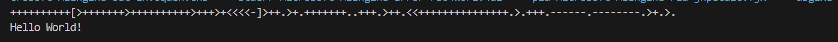

# Brainfuck Programming language

## Introduction

Brainfuck is a programming language that is designed to attack our brain.

## Instructions

In this language :

- '+' -> Will add by '+' count
- '-' -> Will remove by '-' count
- '.' -> Will print the current location value
- ',' -> Will allow user to give input
- '[]' -> Will act like a loop

## Features

It is developed in C language which means it faster and also optimized for speeder input and output operations.

## Output

